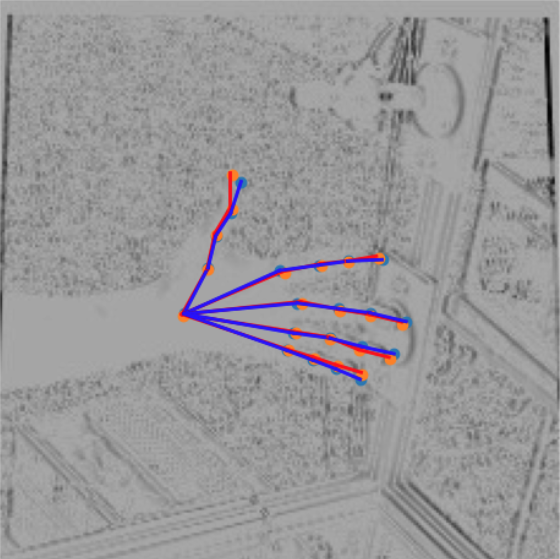

# Hand Pose Visualization Tool

This repository contains a Python script (`plot_hand.py`) designed to visualize hand poses using images and corresponding 3D hand keypoints. It projects these keypoints onto the image and aligns predicted points with ground truth points to visualize the results.

## Prerequisites

Before you begin, make sure you have the following software and libraries installed:

- Python 3.x
- `matplotlib`
- `numpy`
- `torch`
- `opencv-python` (cv2)
- `scikit-image`
- `json`

You can install these dependencies with the following command:
```bash
pip install matplotlib numpy torch opencv-python scikit-image
```

## Usage

### Step 1: Setup the Dataset
You will need specific datasets that include images, camera matrices, and hand keypoints. The dataset paths and filenames used in the code include:
- **Evaluation Images:** Change the images path to img_path
- **Camera Parameters (evaluation_K.json):** Change the Camera parameters to k_path
- **3D Hand Keypoints (evaluation_xyz.json):** Change the groundtruth to xyz_path
- **Prediction of 3D keypoints:** 
We would offer prediction when above information is prepared  

### Step 2: Update File Paths
Make sure to modify the file paths in the code to match the location of your dataset files. Look for lines like this and change them to point to your dataset's path:
```python
img_path = os.path.join(f"/media/public_dataset2/FreiHAND", "evaluation", "gray_224", "%08d" % num + ".jpg")
k_path = os.path.join('/media/public_dataset2/FreiHAND/evaluation_K.json')
xyz_path = os.path.join("/media/public_dataset2/FreiHAND/evaluation_xyz.json")
gray_path = os.path.join(f"/media/Pluto/Hao/HandMesh_origin/mobrecon/out/MultipleDatasets/mrc_ds_{set_name}/mrc_ds_{set_name}.json")
```

### Step 3: Running the Script
To run the script, execute the following command in your terminal:
```bash
python plot_hand.py
```

This will process the image, align the predicted hand keypoints with the ground truth, and create a visualization of the hand pose. The output will be saved as an image named `<set_name>_No<num>.png` in the current directory.

### Visualization
- **Red Lines:** Represent the ground truth hand keypoints.
- **Blue Lines:** Represent the predicted hand keypoints.

The points are plotted on top of the image in grayscale for easy comparison.

### Example Output
The output image shows the hand keypoints connected by lines, providing a visual comparison of the predicted keypoints versus the ground truth keypoints.


## Notes
- Ensure that the dataset paths are correctly configured for your environment.
- Adjust the parameters like `num` and `set_name` in the script to visualize different images or datasets.

## License
This project is licensed under the MIT License - see the [LICENSE](LICENSE) file for details.
